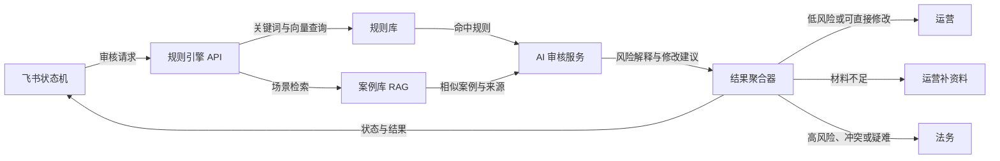

# 广告合规 AI 案例库联调说明

> 版本：v0.1
> 更新日期：2026-07-15
> 适用范围：案例库 RAG、规则引擎、AI 审核服务与飞书状态机之间的首次联调

> 接口路径、请求字段和返回字段已在 2026-07-18 收敛，联调时以
> [`案例库接入接口确认稿.md`](案例库接入接口确认稿.md) 为准。本文保留作架构和验收背景，
> 其中 `/v1/cases/search` 仅是早期建议，不作为当前对接接口。

## 1. 联调目标

本次联调验证以下完整链路：

1. 飞书状态机提交待审核广告物料；
2. 规则引擎以关键词和语义向量召回规则；
3. 案例库按广告场景召回可追溯案例，为规则解释和风险说明提供辅助依据；
4. AI 模型结合物料、命中规则和案例上下文生成审核说明；
5. 聚合多条命中结果并分流到运营、运营补资料或法务；
6. 全链路保留请求标识、规则版本、索引版本和来源链接，支持复盘。

案例库只服务于规则 RAG 和监管口径解释，不替代规则引擎，不负责产品功效事实核验，也不直接输出最终法律结论。

## 2. 当前可用资产与限制

本仓库目前提供数据流水线和联调测试数据，未包含可运行的 HTTP API 服务。因此，本文件中的接口地址和鉴权方式属于双方待确认的建议契约，不能视为已上线接口。

| 资产 | 路径 | 用途 | 是否可用于生产召回 |
| --- | --- | --- | --- |
| 已核验案例切片 | `data/chunks/production_chunks.json` | 正式案例 RAG | 是，但当前文件为空 |
| 通用候选案例切片 | `data/chunks/candidate_chunks.json` | 内部检索和来源核验 | 否 |
| 游戏、美妆、保健品候选切片 | `data/chunks/sector_candidate_chunks.json` | 赛道检索和联调 | 否 |
| `/audit` 物料测试集 | `data/audit_test_cases/real_mvp_cases_v0.1.json` | 规则引擎回归测试 | 否，不进入案例 RAG |
| 案例字段校验报告 | `data/reports/validation_report.md` | 定位缺失字段和待复核项 | 不适用 |
| 切片构建报告 | `data/reports/chunk_build_report.md` | 核对案例进入哪个索引 | 不适用 |

当前候选数据的 `source_url` 尚未完成核验，`review_status` 为 `pending_review`，且 `approved_for_rag` 为 `false`。联调环境可以显式使用候选数据检查召回效果，但界面必须展示“待来源核验”，不得将处罚机关、金额、法律依据或裁判结论作为已确认事实对外呈现。

截至 2026-07-15 的本地快照为：正式案例切片 0 条、通用候选切片 104 条、三赛道候选切片 108 条、`/audit` 测试物料 20 条。切片是派生数据，联调时应以重新执行构建命令后的实际计数为准。

## 3. 系统边界

### 3.1 是否构成广告

案例库不单独判断输入是否在法律上构成广告。上游应传入内容性质：

- `ad`：按广告审核链路处理；
- `suspected_ad`：继续检索，但在结果中提示需确认广告属性；
- `non_ad`：不进入广告法规则自动结论，可按业务需要标注其他公法或反不正当竞争风险；
- `unknown`：不得默认认定为广告，应返回“需确认内容性质”。

“未命中广告规则”不等于“内容合规”，也不等于“不构成广告”。

### 3.2 广告法与反不正当竞争风险

同一表述可能同时触发广告监管和反不正当竞争风险。v0.1 建议由规则引擎保留两个独立风险标签：

```json
{
  "ad_law_risk": true,
  "competition_law_risk_hint": true
}
```

案例库只返回相似监管场景和来源，不决定法律竞合关系、处罚依据选择或处罚幅度。存在竞合、规则冲突或处罚口径不清时，统一分流法务。

### 3.3 特定主体和场景

代言、未成年人、医疗健康、普通食品疾病功效、概率公示等场景依赖额外事实。缺少下列信息时不得作确定性结论，应返回 `missing_context`：

- 主体身份及是否属于代言人；
- 是否涉及未成年人及其具体角色；
- 产品类别、批准或备案属性；
- 发布平台、物料类型和完整上下文；
- 功效、数据、概率、引证或用户评价的证明材料；
- 活动条件、适用范围、有效期和限制条件。

## 4. 联调拓扑与职责



| 模块 | 主要职责 | 不承担的职责 |
| --- | --- | --- |
| 飞书状态机 | 收集物料、补充上下文、展示结果、流转任务 | 自行解释法律依据 |
| 规则引擎 | 规则召回、刚性/柔性标识、单规则风险判断 | 将案例相似度直接当作违法结论 |
| 案例库 RAG | 返回相似案例、监管逻辑、来源和候选规则映射 | 判断产品事实真伪、确定处罚幅度 |
| AI 审核服务 | 基于已提供上下文生成解释、修改建议和缺失材料 | 编造案例、依据或证明材料 |
| 结果聚合器 | 去重、合并多规则结果、确定最终分流 | 覆盖法务人工结论 |

## 5. `/audit` 请求约定

现有测试集中的 `input_payload` 可直接作为规则引擎 `/audit` 的请求体。首次联调建议维持以下字段：

```json
{
  "record_id": "real_cosm_001",
  "mode": "标准",
  "industry": "美妆",
  "content": "杀菌、消炎、镇痛",
  "urgency": "普通",
  "supplement": "",
  "platform": ["微信公众号", "线下"],
  "material_type": "图文",
  "product_category": "美容产品",
  "content_nature": "ad",
  "extras": {
    "核心宣称功效": ["杀菌", "消炎", "镇痛"],
    "物料涉及场景": "公众号、手册和挂纸宣传"
  }
}
```

字段约定：

| 字段 | 类型 | 必填 | 说明 |
| --- | --- | --- | --- |
| `record_id` | string | 是 | 飞书记录或业务请求的唯一标识；重试时保持不变 |
| `mode` | string | 是 | 当前测试值为 `标准` |
| `industry` | string | 是 | 当前测试枚举：`美妆`、`保健食品`、`游戏`、`通用` |
| `content` | string | 是 | 完整待审核文案，不得只发送已疑似违规的片段 |
| `urgency` | string | 是 | `普通` 或 `加急`；不影响法律风险等级 |
| `supplement` | string | 是 | 证明材料、活动规则或人工补充信息；没有时传空字符串 |
| `platform` | string[] | 是 | 至少一个发布平台 |
| `material_type` | string | 是 | 当前枚举：`图文`、`短视频`、`直播话术`、`Banner`、`详情页`、`其他` |
| `product_category` | string | 是 | 具体产品或服务类别 |
| `content_nature` | string | 建议新增 | `ad`、`suspected_ad`、`non_ad` 或 `unknown` |
| `extras` | object | 是 | 行业特定事实，不应放入法律预期答案 |

注意：`human_reference` 和 `provenance` 是离线评估字段，不得发送给线上 `/audit`，否则会造成答案泄漏。

## 6. 案例检索接口建议契约

### 6.1 待双方填写的环境参数

| 参数 | 测试环境 | 生产环境 |
| --- | --- | --- |
| Base URL | `TBD` | `TBD` |
| 鉴权方式 | `TBD` | `TBD` |
| 鉴权请求头 | `TBD` | `TBD` |
| 连接/响应超时 | `TBD` | `TBD` |
| 重试策略 | `TBD` | `TBD` |
| 当前规则版本 | `TBD` | `TBD` |
| 当前案例索引版本 | `TBD` | `TBD` |

任何密钥、Cookie 或 Token 只能通过部署环境的密钥管理或环境变量注入，不得写入仓库、示例代码或联调日志。

### 6.2 健康检查

建议接口：`GET /healthz`

```json
{
  "status": "ok",
  "service": "ads-penalty-rag",
  "index_version": "2026-07-15T00:00:00+08:00",
  "production_case_count": 0,
  "production_chunk_count": 0
}
```

计数必须来自服务实际加载的索引，不能在代码中写死。正式环境的 `production_case_count` 或 `production_chunk_count` 为 `0` 时，健康检查可保持存活，但应同时触发数据未就绪告警。

### 6.3 场景检索

建议接口：`POST /v1/cases/search`

请求示例：

```json
{
  "request_id": "audit_20260715_0001",
  "query": "普通食品包装宣称可以抑制肿瘤并预防心脑血管疾病",
  "industry": "保健食品",
  "product_or_service": "普通食品",
  "ad_channel": "商品包装",
  "risk_dimensions": ["普通食品疾病治疗功效宣传"],
  "rule_ids": ["TBD_RULE_ID"],
  "top_k": 5,
  "retrieval_mode": "hybrid",
  "data_scope": "production_only",
  "include_debug": false
}
```

请求字段：

| 字段 | 类型 | 必填 | 约定 |
| --- | --- | --- | --- |
| `request_id` | string | 是 | 与 `/audit` 全链路请求标识一致 |
| `query` | string | 是 | 自然语言场景描述；建议包含主体、产品、渠道、宣称和关键上下文 |
| `industry` | string | 否 | 行业过滤或加权条件 |
| `product_or_service` | string | 否 | 产品或服务过滤或加权条件 |
| `ad_channel` | string | 否 | 发布渠道过滤或加权条件 |
| `risk_dimensions` | string[] | 否 | 规则引擎已识别的风险维度 |
| `rule_ids` | string[] | 否 | 已命中的规则标识，用于案例映射过滤或加权 |
| `top_k` | integer | 否 | 建议默认 5，允许范围 1—20 |
| `retrieval_mode` | string | 否 | `lexical`、`semantic` 或 `hybrid`，建议默认 `hybrid` |
| `data_scope` | string | 是 | 正式调用必须为 `production_only` |
| `include_debug` | boolean | 否 | 是否返回分项分数和调试信息；生产环境默认 `false` |

成功响应示例：

```json
{
  "request_id": "audit_20260715_0001",
  "index_version": "2026-07-15T00:00:00+08:00",
  "data_scope": "production_only",
  "total": 1,
  "hits": [
    {
      "rank": 1,
      "case_id": "verified_case_id",
      "chunk_id": "verified_case_id__case_summary",
      "chunk_type": "case_summary",
      "score": 0.87,
      "title": "某市场监管部门公开案例",
      "risk_dimensions": ["普通食品疾病治疗功效宣传"],
      "matched_rule_ids": ["TBD_RULE_ID"],
      "hit_reason": "商品类别、包装渠道和疾病功效宣称场景相似",
      "regulatory_logic": "监管逻辑摘要",
      "illegal_claims": ["原案例中的广告宣称原文"],
      "source_name": "公开来源名称",
      "source_url": "https://example.gov.cn/case/123",
      "raw_text_path": "data/raw_text/verified_case_id.json",
      "review_status": "approved",
      "source_verification_status": "source_verified",
      "approved_for_rag": true
    }
  ],
  "warnings": []
}
```

上述案例仅为接口字段占位示例，`verified_case_id`、标题和 URL 不代表真实案例。真实响应必须来自已核验数据，不得复用示例值。

### 6.4 单案例回溯

建议接口：`GET /v1/cases/{case_id}`。响应至少包含项目要求的全部字段：

`case_id`、`title`、`source_name`、`source_url`、`publish_date`、`penalty_authority`、`party_name`、`industry`、`product_or_service`、`ad_channel`、`risk_dimensions`、`illegal_claims`、`facts_summary`、`legal_basis`、`penalty_result`、`penalty_amount`、`regulatory_logic`、`mapped_rule_ids`、`keywords`、`vector_text`、`review_status`，以及人工回溯所需的 `raw_text_path`、`source_verification_status` 和 `approved_for_rag`。

### 6.5 空结果与错误响应

没有可用生产案例时返回成功响应和空数组，不得用候选案例静默补位：

```json
{
  "request_id": "audit_20260715_0001",
  "index_version": "2026-07-15T00:00:00+08:00",
  "data_scope": "production_only",
  "total": 0,
  "hits": [],
  "warnings": ["NO_PRODUCTION_CASE_HIT"]
}
```

建议错误码：

| HTTP 状态 | `code` | 场景 | 调用方处理 |
| --- | --- | --- | --- |
| 400 | `INVALID_REQUEST` | 字段、枚举或 `top_k` 非法 | 不重试，回写飞书失败原因 |
| 401/403 | `UNAUTHORIZED` | 鉴权失败 | 不自动降级，告警人工处理 |
| 404 | `CASE_NOT_FOUND` | 单案例不存在或不可见 | 不重试 |
| 429 | `RATE_LIMITED` | 超出限流 | 按 `Retry-After` 退避重试 |
| 500 | `INTERNAL_ERROR` | 服务内部错误 | 有上限地重试并保留请求标识 |
| 503 | `INDEX_NOT_READY` | 索引未加载完成 | 延迟重试，不得切换到候选索引 |

## 7. 候选数据的联调开关

为验证召回质量，可在隔离的测试环境支持 `data_scope = candidate_debug`，但必须同时满足：

1. 接口仅对项目成员开放；
2. 响应固定返回 `candidate_data: true`；
3. 每条结果展示 `source_verification_status`、`review_status` 和 `approved_for_rag`；
4. 飞书界面显著展示“待来源核验，不得对外引用”；
5. 候选结果不得作为最终法律依据或处罚事实；
6. 生产环境禁用该开关。

不得因为生产索引为空而自动回退到候选索引。

## 8. 多规则命中与分流建议

### 8.1 结果去重和合并

1. 先按 `rule_id + claim_span` 去重同一规则的关键词、向量和模型重复命中；
2. 再按风险维度归组，保留最高风险和最刚性的命中作为该组主结果；
3. 同一案例的两个 chunk 只显示一张案例卡片，`case_summary` 和 `regulatory_logic` 合并展示；
4. 同一案例命中多条规则时，案例只计一次，但保留全部 `matched_rule_ids`；
5. 规则命中与案例相似度不得相互覆盖：规则决定风险，案例用于解释和佐证。

### 8.2 最终分流

建议按下列优先级确定一次审核的最终路由：

| 条件 | 最终路由 |
| --- | --- |
| 任一高风险刚性规则命中 | 法务 |
| 规则冲突、法律竞合、广告属性不清或特定主体事实不足 | 法务 |
| 风险依赖证明材料、资质、概率或活动条件，且当前材料不足 | 运营补资料 |
| 仅命中可直接修改的低风险或柔性规则 | 运营 |
| 零规则命中 | 不输出“合规”；标记“未发现已配置规则风险”，进入 AI 补充审核或抽样人工复核 |

最终响应应同时返回：

```json
{
  "risk_level": "高",
  "routing": "法务",
  "routing_reason": "命中高风险刚性规则；另有证明材料缺失",
  "primary_rule_id": "RULE_ID",
  "matched_rule_ids": ["RULE_ID", "OTHER_RULE_ID"],
  "missing_context": ["产品批准或备案属性", "功效证明材料"]
}
```

风险等级和刚性/柔性枚举最终以规则引擎的数据字典为准。首次联调前，双方需确认是否存在“无明显风险”、是否允许“运营补资料”作为独立路由，以及冲突规则的人工兜底策略。

## 9. `vector_text` 质量约定

当前语义召回质量是本轮重点。每条 `vector_text` 应写成自然语言场景，不得只拼接行业、风险标签和关键词。建议统一包含：

1. 谁在什么渠道发布了什么产品或服务的内容；
2. 原始广告宣称或其忠实概括；
3. 需要核验的事实、资质、证明材料或限制条件；
4. 监管机关认定风险的核心逻辑；
5. 仅在来源已核验时，写入明确的法律依据和处理结果。

推荐示例：

> 某普通食品经营者在商品包装上宣称产品能够预防心脑血管疾病并抑制肿瘤。该表述可能使消费者将普通食品理解为具有疾病预防或治疗功能，需要核验产品类别、批准功能和功效证明材料；如无相应依据，应重点关注普通食品疾病功效宣传风险。

不合格示例：

> 普通食品、包装、心脑血管、抑制肿瘤、虚假宣传、保健品。

首轮质量评估至少记录以下指标：

| 指标 | 说明 |
| --- | --- |
| `Recall@5` | 人工标注相关案例是否出现在前 5 条 |
| `MRR` | 首条相关案例的平均倒数排名 |
| 零结果率 | 有明确风险场景但无任何召回的占比 |
| 错赛道率 | 前 5 条中行业明显不相关结果的占比 |
| 来源可追溯率 | 返回结果同时具备 `source_url` 和 `raw_text_path` 的占比 |
| 候选泄漏率 | `production_only` 返回候选数据的占比，目标必须为 0 |

## 10. 联调步骤

### 10.1 案例库侧自检

```bash
python3 src/validate_cases.py
python3 src/build_chunks.py
python3 src/validate_audit_cases.py
python3 -m unittest discover -s tests
```

确认 `data/reports/validation_report.md`、`data/reports/chunk_build_report.md` 和 `data/reports/audit_test_case_validation_report.md` 均已生成，并记录当前 `production_chunks.json` 的数量。

### 10.2 规则引擎侧自检

1. 确认测试环境 Base URL、鉴权、限流和超时；
2. 固定规则版本并导出规则 ID、风险等级、刚性/柔性和路由枚举；
3. 确认关键词召回、向量召回和融合排序均可单独观测；
4. 确认多规则命中不会被后返回结果覆盖；
5. 确认返回结果包含可回写飞书的 `request_id`。

### 10.3 飞书状态机侧自检

1. 字段枚举与 `/audit` 请求一致；
2. 只发送 `input_payload`，不发送人工预期答案；
3. 正确处理成功、空结果、超时和错误状态；
4. 展示最终路由、主规则、全部命中规则、缺失材料和案例来源；
5. 候选案例必须展示醒目标识，生产环境不得请求候选数据；
6. 同一个 `record_id` 重试时保留历史记录，不产生重复任务。

### 10.4 端到端测试

首轮使用仓库中的 20 条 `/audit` 测试案例：

```bash
make audit-cases
```

逐条只发送 `input_payload`，将接口实际结果与 `human_reference` 比较。至少统计：风险等级准确率、路由准确率、违规类型命中率、案例 `Recall@5`、平均响应时间、P95 响应时间和失败率。

## 11. 验收标准

### 11.1 必须通过

- 20 条测试请求全部能形成可追踪的最终状态；
- `/audit` 请求不包含 `human_reference` 或 `provenance`；
- 多规则命中时不丢失规则，最终路由符合“最高风险优先”；
- `production_only` 不返回任何候选或离线样例；
- 所有案例命中均返回 `case_id`、`source_url`、`raw_text_path` 和审核状态；
- 案例索引为空时明确返回空结果，不伪造或自动降级到候选案例；
- 日志不包含 API key、Token、Cookie 或完整敏感物料；
- 同一 `record_id` 的重试可关联，且不会产生不可控重复任务。

### 11.2 需要项目组确认

- 规则等级、刚性/柔性和路由的最终枚举；
- 广告属性由上游人工选择、独立模型判断还是规则判断；
- 反不正当竞争风险提示是否进入飞书主结果；
- 代言人、未成年人等场景需要补充的必填字段；
- 候选案例是否允许在隔离测试环境展示；
- AI 模型、温度、超时、失败降级和人工抽检比例；
- 规则命中与案例命中的线上质量阈值。

## 12. 联调问题记录模板

| 字段 | 说明 |
| --- | --- |
| 发生时间 | 使用带时区的时间 |
| 环境 | test / staging / production |
| `record_id` / `request_id` | 用于跨系统定位 |
| 规则版本 / 索引版本 / 模型版本 | 三者均需记录 |
| 请求摘要 | 脱敏后的行业、渠道和场景 |
| 预期结果 | 风险、路由、规则和案例 |
| 实际结果 | 同上 |
| 问题分类 | 字段、召回、模型、聚合、飞书状态、网络或权限 |
| 复现步骤 | 最小复现输入和步骤 |
| 责任方 | 案例库、规则引擎、AI、飞书或待确认 |
| 处理状态 | 待确认、处理中、已修复、已验证 |

## 13. 首次联调会前待补齐信息

- [ ] 规则引擎测试环境 Base URL；
- [ ] 鉴权方式、请求头和凭证发放方式；
- [ ] `/audit` 当前真实请求与响应样例；
- [ ] 规则 ID、风险等级、刚性/柔性和路由数据字典；
- [ ] 是否已有独立案例检索 API；如无，确认由规则引擎内嵌读取还是新建服务；
- [ ] 飞书字段 ID 与接口字段映射；
- [ ] AI 模型接入方式及测试环境可用性；
- [ ] 20 条测试案例的执行人、复核人和问题记录位置；
- [ ] 生产案例来源核验与法务审批负责人。
